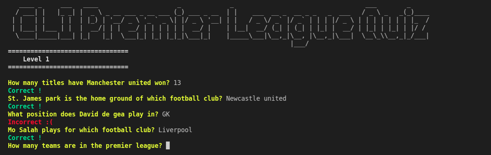

# CLI-Quiz  
A CLI Premier league quiz app built using nodejs.  

  

You can run the code in your browser,check it out [here](https://replit.com/@Pranjalmishra30/CLI-Quiz?embed=1&output=1)

## Running the code locally  
Install [nodejs](https://nodejs.org/en/download/) if not installed already.    
1. Clone the repository  
`git clone https://github.com/Pranjalmishra30/CLI-Quiz`  
2. Install the dependencies  
`npm install`  
3. Run the quiz app  
`node index.js`  

## Future work  
1. Retrieve questions from a database.  
2. Implement hints in the quiz.  
3. Add more levels and questions. Special questions based on user's club of choice.  
4. Implement high score feature.  

## References  
1. Build a [CLI app](https://www.youtube.com/watch?v=_L-UszPmy2A&t=795s)  
2. [readline-sync](https://www.npmjs.com/package/readline-sync) documentation  
3. [chalk](https://www.npmjs.com/package/readline-sync) documentation
